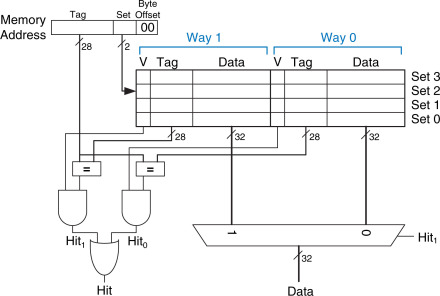
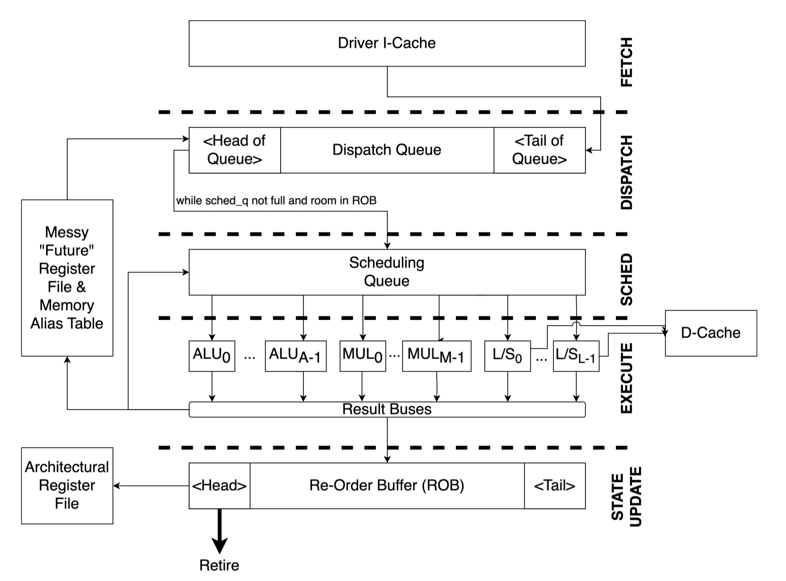

# ECE6100/CS6290 Projects

Hi visitors. I am a master student at Georgia Tech and this reposory is for ECE6100/CS6290 2024 Spring.

### Project 1 : Cache simulator(90/90)

* Write-Back/Write-Allocate L1 cache
* Write-Through/Write-No-Allocate L2 cache
* Insertion policy, replacement policy, prefetching.

### Project2 : Tomasulo & Branch Predictor Simulator(90/90)

Branch Predictor:

* The GShare Predictor
* The Yeh-Patt Predictor

Out-of-Order execution:

* Tomasulo's algorithm, 
* Memory Disambiguation
* ROB
* Future Register file

It is physically suffering doing this project. But learned some thing.

:cry::cry::joy::joy:

**These public repository is for learning purpose. Please adhere to the GT Student Honor Code and do not plagiarize.**

Hope this helps you.

Bo Pang

:smile::birthday::smile_cat::book:

