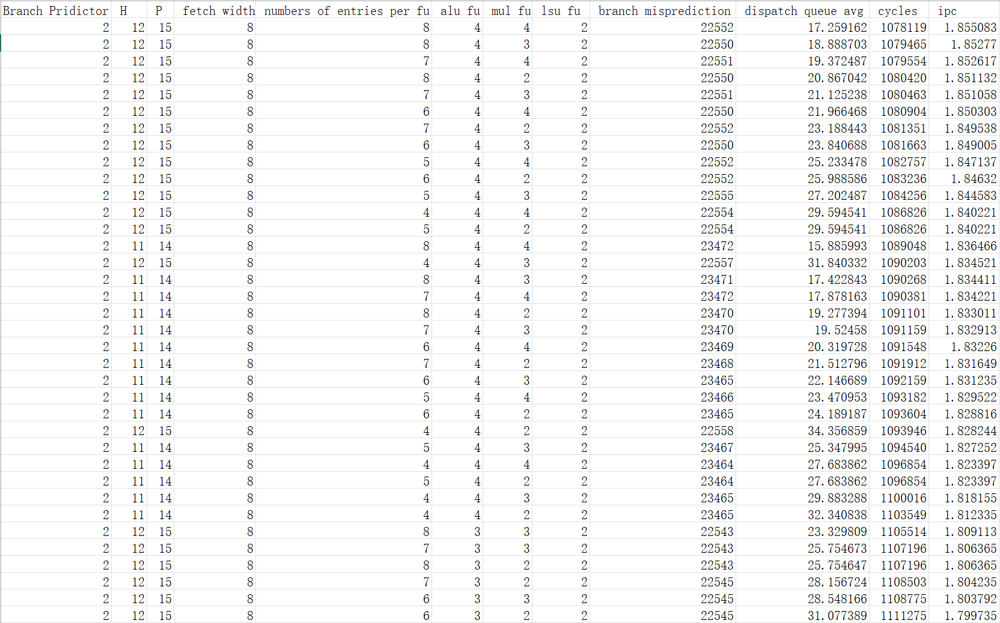
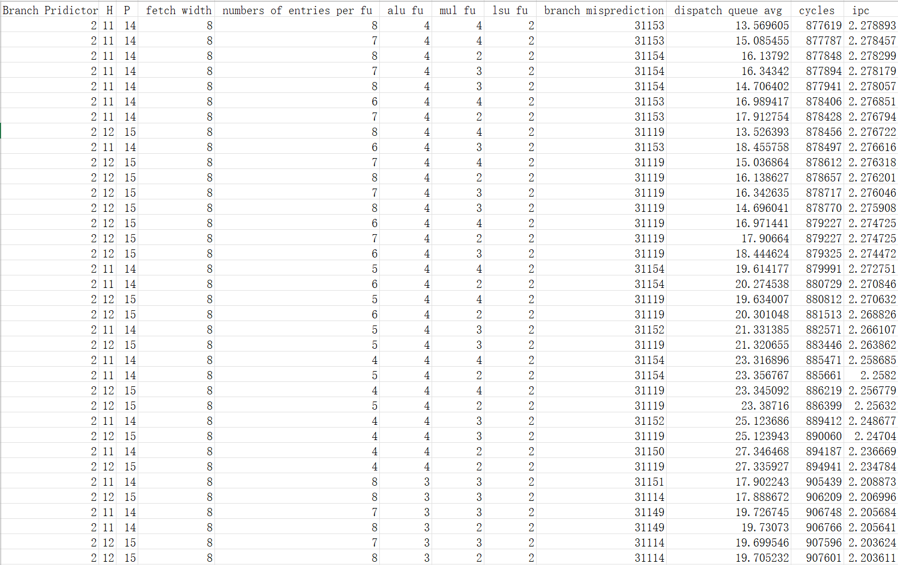
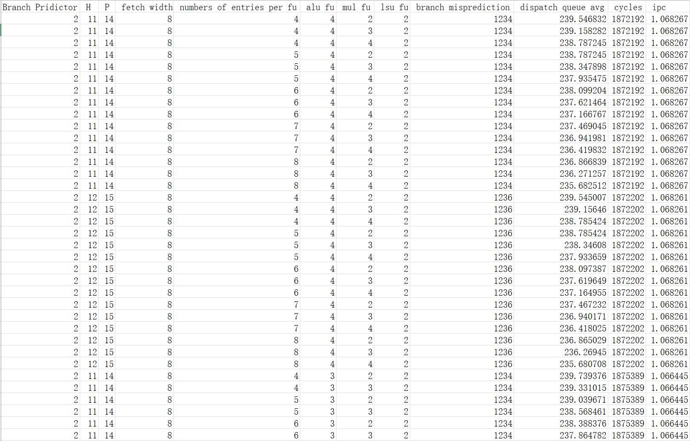
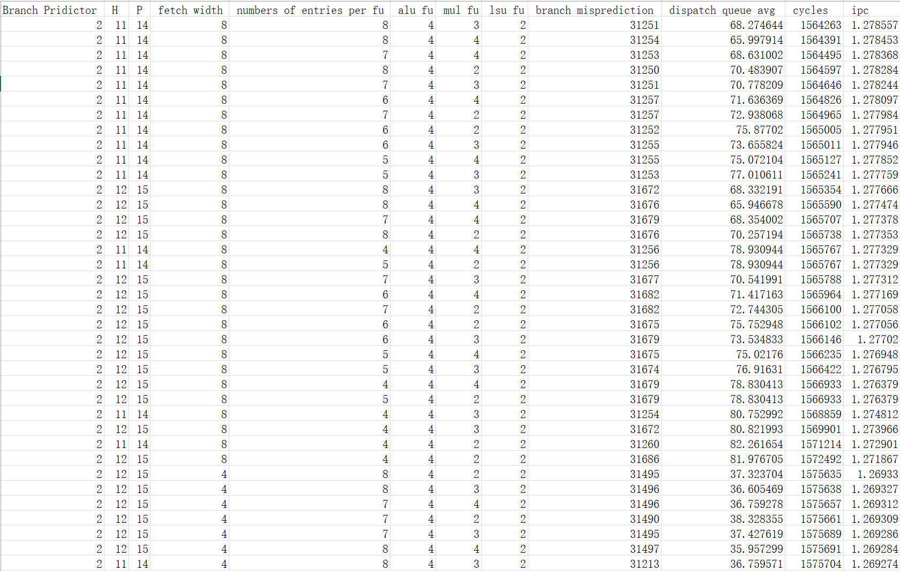
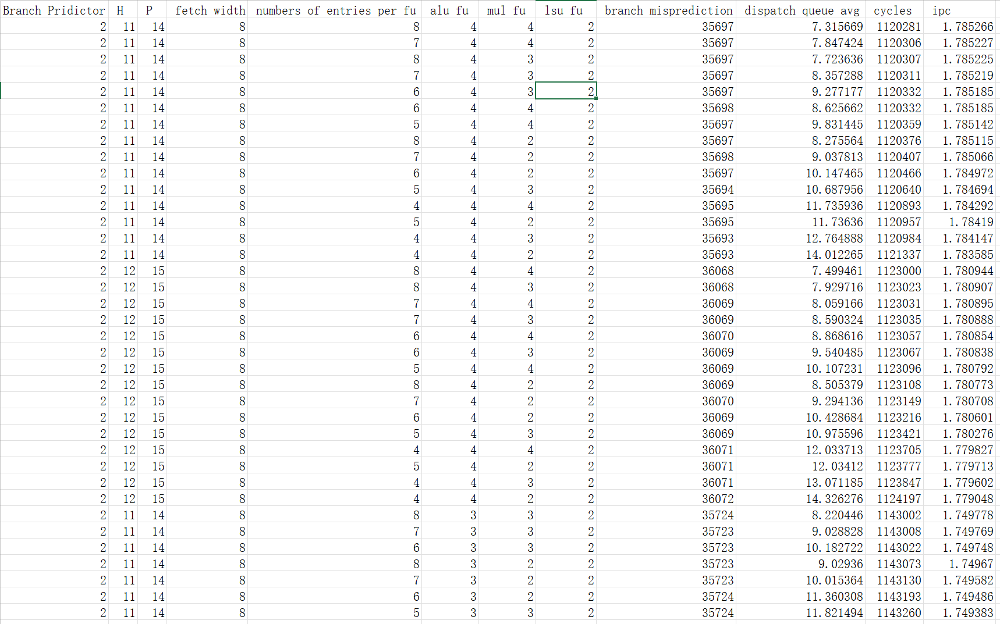

### CS6290 Project2 Report

In this experiment, I need to find the best configuration for different traces. My strategy is to run most of the configurations within the configuration space and record the data in a CSV table. The obtained data will be sorted in descending order of IPC, prioritizing the highest IPC. For configurations with the similar IPC, the one with a higher average hardware utilization rate is chosen.

#### Deepsjeng531_2M

This is the top 30 configuration combinations I have recorded:

As can be seen, the highest IPC is obtained when using the `Yeh-Patt Predictor with h=12, p=15, fetch width=8, numbers of entries per FU=8, ALU=4, MUL=4, and LSU=2`. However, it can be observed that the IPCs of the top ten configurations are very close, but they have different average utilizations of the dispatch queue. Among the top twenty, the highest utilization rate is 31%, and an IPC of 1.8345 is achieved.

Therefore, the configuration we chose is:

`Yeh-Patt Predictor，h=12, p=15, fetch width=8, numbers of entries per fu = 4, alu =4, mul = 3, lsu = 2`

#### Leela541_2M

Regarding this trace, it can be seen that the highest IPC can reach 2.278893 when using: `Yeh-Patt Predictor with h=11, p=14, fetch width=8, numbers of entries per FU=8, ALU=4, MUL=4, and LSU=2`. However, the IPCs of the top twenty configurations are all very close, so we need to look for configurations with high hardware utilization rates. It can be observed that the utilization of the dispatch queue reaches up to 20.27 in the top twenty, while maintaining an IPC of 2.2708.

Therefore, the configuration we choose is the one has high ipc and high hardware utilization:

`Yeh-Patt Predictor with h=11, p=14, fetch width=8, numbers of entries per FU=6, ALU=4, MUL=2, and LSU=2`.

#### Xz557_2M:

Regarding this trace, it can be seen that the highest IPC can reach 1.068267 when using: `Yeh-Patt Predictor with h=11, p=14, fetch width=8, numbers of entries per FU=4, ALU=4, MUL=2, and LSU=2`. At the same time, this configuration ensures a high hardware utilization rate.

Therefore, the configuration we have chosen is:

`Yeh-Patt Predictor with h=11, p=14, fetch width=8, numbers of entries per FU=4, ALU=4, MUL=2, and LSU=2`.

#### Mcf505

Regarding this trace, it can be observed that the highest IPC can reach 1.278557 when using: `Yeh-Patt Predictor with h=11, p=14, fetch width=8, numbers of entries per FU=8, ALU=4, MUL=3, and LSU=2`. This configuration also ensures a high hardware utilization rate, being 100 cycles faster compared to the second one. Therefore, the configuration we have chosen is: `Yeh-Patt Predictor with h=11, p=14, fetch width=8, numbers of entries per FU=8, ALU=4, MUL=3, and LSU=2`.

#### nab544

Regarding this trace, it can be seen that the highest IPC can reach 1.785266 when using: `Yeh-Patt Predictor with h=11, p=14, fetch width=8, numbers of entries per FU=8, ALU=4, MUL=4, and LSU=2`. Compared to the second-place configuration, it is faster by 25 cycles. Therefore, the configuration we have chosen is: `Yeh-Patt Predictor with h=11, p=14, fetch width=8, numbers of entries per FU=8, ALU=4, MUL=4, and LSU=2`.